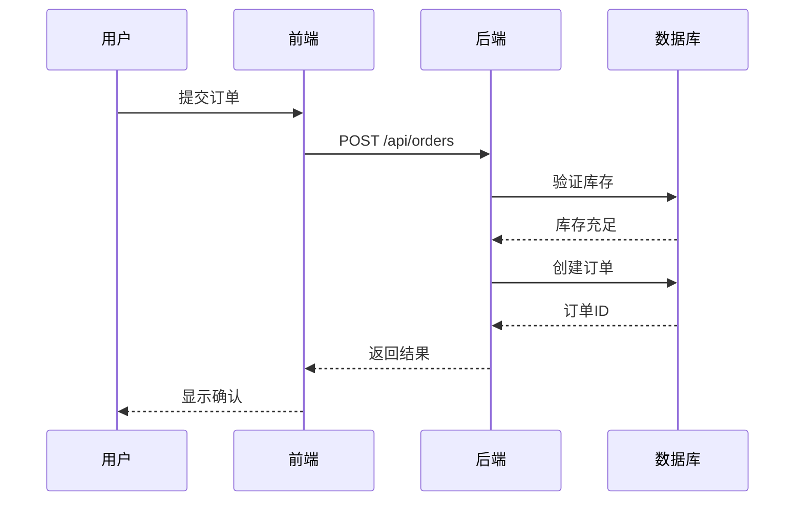
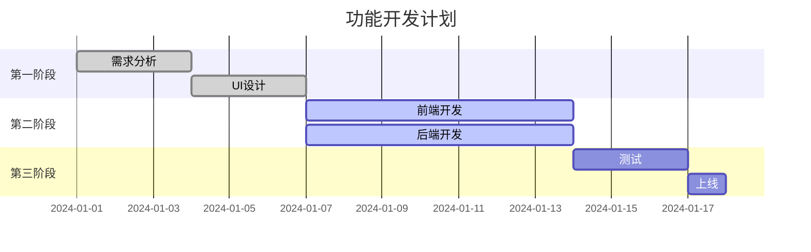

# Mermaid 图表集成 - 快速开始

## 🎉 新功能：Mermaid 图表支持

现在可以在 AI 助手的回复中包含 Mermaid 图表，支持流程图、序列图、甘特图等多种可视化类型。

### ✨ 最新优化

- ✅ **透明背景**: 图表背景自动适应页面颜色
- ✅ **源代码查看**: 每个图表上方都有"查看源代码"按钮，点击可折叠展开
- ✅ **优雅交互**: 流畅的折叠动画和友好的按钮样式

## 快速测试

### 1. 访问测试页面

启动开发服务器后，访问：

```
http://localhost:3000/test-components
```

点击 **🔷 Mermaid 图表** 标签页，查看各种图表示例。

### 2. 在 AI 回复中使用

后端返回的消息内容可以包含 Mermaid 代码块：

````python
# 示例：Python 后端返回 Mermaid 图表
def generate_response():
    return """
我来解释一下系统的工作流程：

```mermaid
graph TD
    A[用户请求] --> B{判断类型}
    B -->|查询| C[执行检索]
    B -->|分析| D[调用工具]
    C --> E[生成回复]
    D --> E
````

这个流程图展示了系统如何处理不同类型的请求。
"""

````

### 3. 在 React 组件中直接使用

```tsx
import { MermaidDiagram } from '@/components/thread/mermaid-diagram';

export function MyChart() {
  const diagram = `
    graph LR
      A[开始] --> B[处理]
      B --> C[结束]
  `;

  return <MermaidDiagram chart={diagram} />;
}
````

## 支持的图表类型

| 类型   | 关键词            | 用途           |
| ------ | ----------------- | -------------- |
| 流程图 | `graph`           | 展示流程和逻辑 |
| 序列图 | `sequenceDiagram` | 展示时序交互   |
| 甘特图 | `gantt`           | 展示项目计划   |
| 饼图   | `pie`             | 展示数据占比   |
| 类图   | `classDiagram`    | 展示类结构     |
| 状态图 | `stateDiagram`    | 展示状态转换   |
| ER图   | `erDiagram`       | 展示数据关系   |

## 示例场景

### 场景 1：解释技术架构

**用户问**："系统架构是怎样的？"

**AI 回复**：

````markdown
我们的系统采用微服务架构：

```mermaid
graph LR
    A[前端 React] --> B[API 网关]
    B --> C[LangGraph 代理]
    B --> D[FastAPI 服务]
    C --> E[RAG 系统]
    C --> F[工具集]
    E --> G[向量数据库]
```

主要组件说明：

- **LangGraph 代理**：智能决策和流程编排
- **RAG 系统**：检索增强生成
- **工具集**：各种实用工具的集合
````

### 场景 2：展示工作流程

**用户问**："订单是怎么处理的？"

**AI 回复**：

````markdown
订单处理包含以下步骤：



整个过程通常在 500ms 内完成。
````

### 场景 3：项目规划

**用户问**："这个功能什么时候能完成？"

**AI 回复**：

````markdown
根据当前的开发计划：



预计在 1月17日 完成上线。
````

## 与后端集成

### Python (FastAPI)

````python
from langchain_core.messages import AIMessage

def create_response_with_diagram():
    content = """
分析完成，这是系统架构图：

```mermaid
graph TD
    A[客户端] --> B[负载均衡]
    B --> C[应用服务器1]
    B --> D[应用服务器2]
    C --> E[数据库]
    D --> E
````

这个架构支持高可用和负载均衡。
"""

    return AIMessage(content=content)

````

### 直接在 additional_kwargs 中返回（可选）

```python
# 如果需要作为特殊组件返回
return AIMessage(
    content="系统架构如下：",
    additional_kwargs={
        "component": {
            "type": "mermaid",
            "data": {
                "chart": """
graph TD
    A[开始] --> B[处理]
    B --> C[结束]
"""
            }
        }
    }
)
````

## 最佳实践

### ✅ 推荐做法

1. **保持图表简洁**：避免过于复杂的图表，影响可读性
2. **使用中文标签**：提高用户理解
3. **添加文字说明**：图表 + 文字解释效果最好
4. **选择合适类型**：根据场景选择最适合的图表类型

### ❌ 避免的做法

1. 不要创建过深的嵌套层级
2. 不要在一个图表中展示过多信息
3. 不要忽略错误处理

## 故障排查

### 图表不显示？

1. 检查 Mermaid 语法是否正确
2. 使用 [Mermaid Live Editor](https://mermaid.live/) 验证语法
3. 查看浏览器控制台的错误信息

### 图表显示错误？

MermaidDiagram 组件会自动显示错误信息和原始代码，方便调试。

## 下一步

- 📖 查看完整文档：[mermaid-support.md](./mermaid-support.md)
- 🧪 访问测试页面：http://localhost:3000/test-components
- 📚 学习 Mermaid 语法：https://mermaid.js.org/

## 技术栈

- **前端**：React 19 + Next.js 15
- **Mermaid 版本**：11.12.0
- **渲染方式**：客户端渲染（"use client"）
- **集成方式**：无缝集成到 MarkdownText 组件

---

如有问题或建议，欢迎反馈！
