# Mermaid 图表支持文档

## 概述

agent-chat-ui 现已支持 Mermaid 图表渲染，可以在 Markdown 内容中嵌入流程图、序列图、甘特图等多种可视化图表。

## 功能特性

- ✅ 自动识别 Markdown 中的 `mermaid` 代码块
- ✅ 支持多种图表类型（流程图、序列图、甘特图、饼图、类图等）
- ✅ 错误处理和友好的错误提示
- ✅ 响应式设计，自适应容器宽度
- ✅ 与现有 Markdown 渲染无缝集成
- ✅ **透明背景**，自动适应页面颜色
- ✅ **源代码查看**，每个图表都有折叠按钮可以展开查看源代码

## 使用方法

### 在 Markdown 中使用

在 Markdown 内容中使用 \`\`\`mermaid 代码块：

````markdown
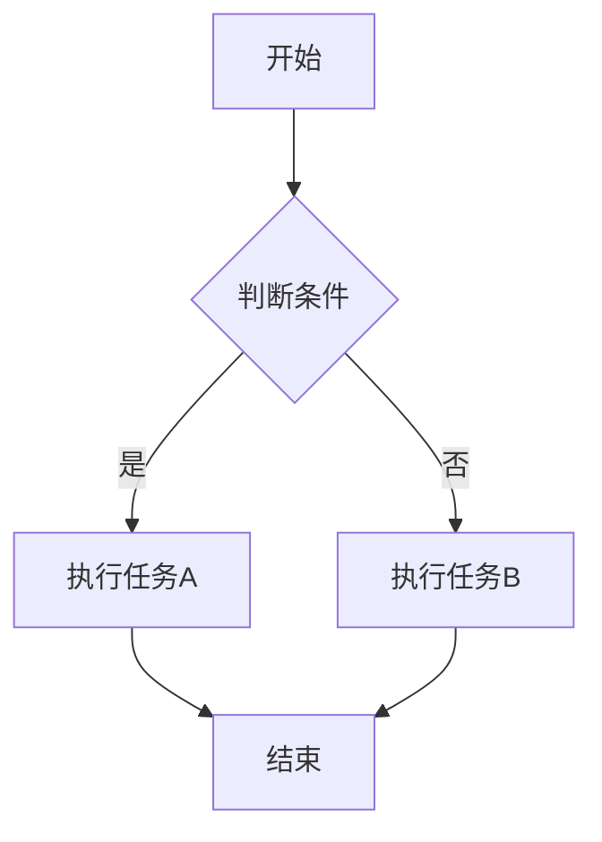
````

### 作为独立组件使用

```tsx
import { MermaidDiagram } from "@/components/thread/mermaid-diagram";

function MyComponent() {
  const chart = `
    graph LR
      A[输入] --> B[处理]
      B --> C[输出]
  `;

  return <MermaidDiagram chart={chart} />;
}
```

## 支持的图表类型

### 1. 流程图 (Flowchart)

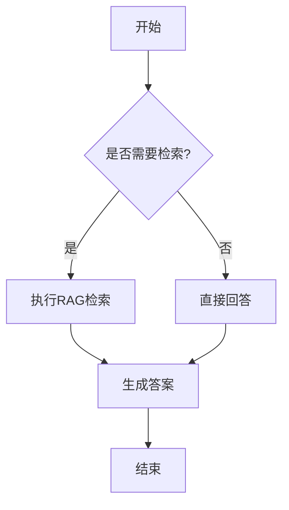

### 2. 序列图 (Sequence Diagram)

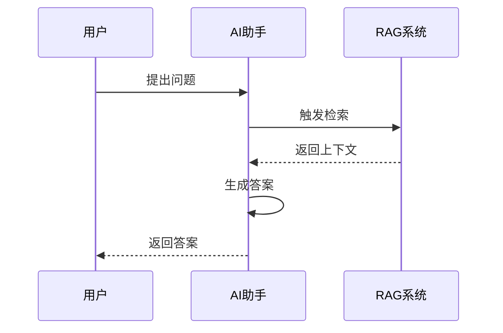

### 3. 甘特图 (Gantt Chart)

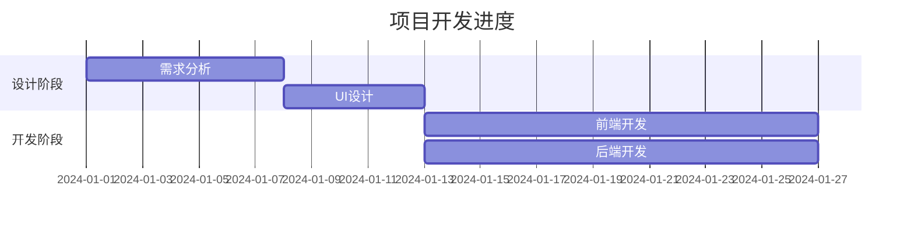

### 4. 饼图 (Pie Chart)

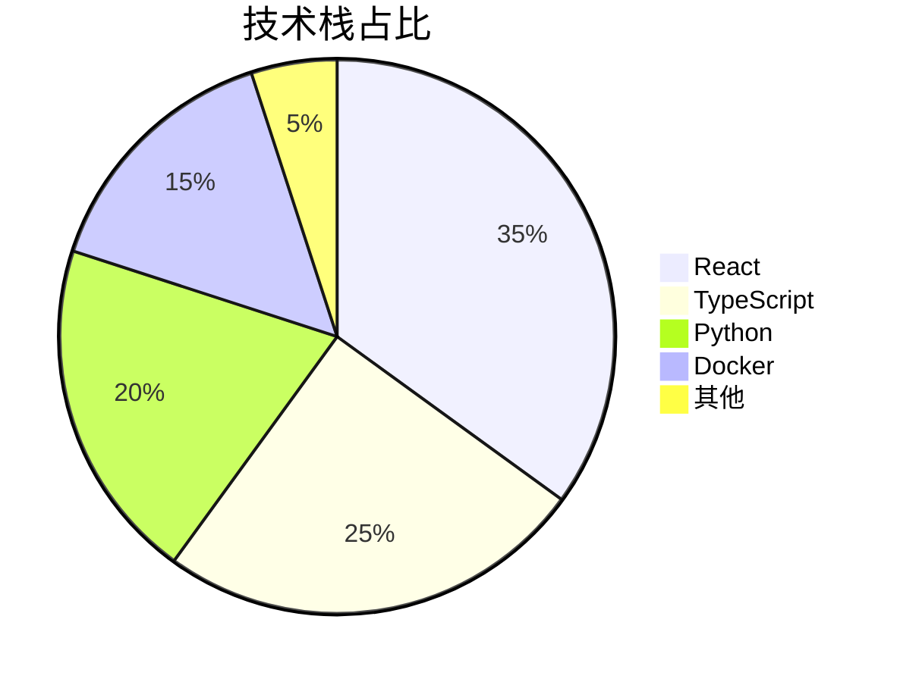

### 5. 类图 (Class Diagram)

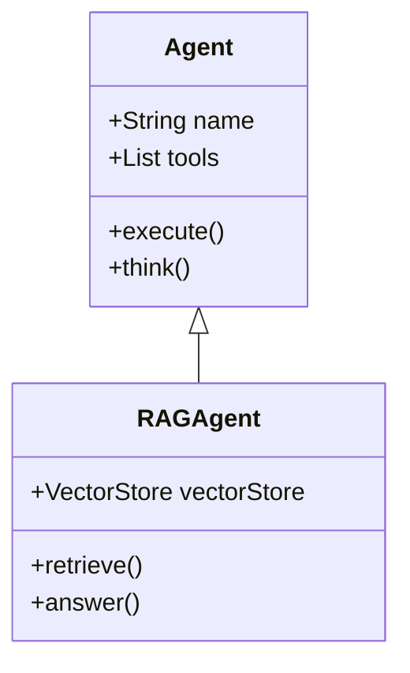

### 6. 状态图 (State Diagram)

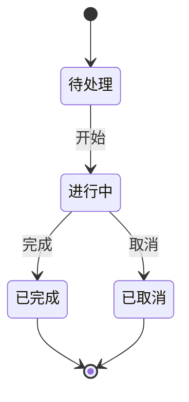

### 7. ER图 (Entity Relationship)

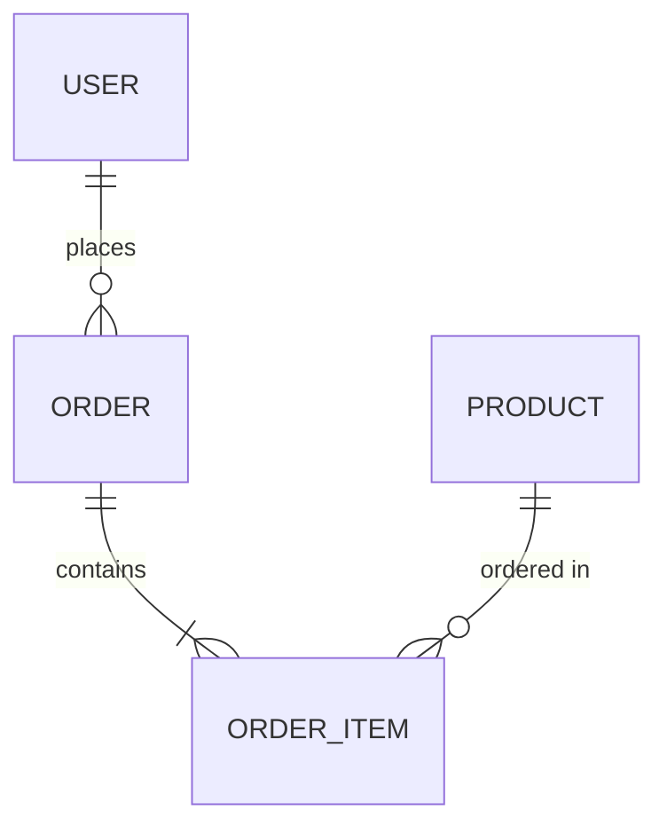

## 在 AI 助手中的应用场景

### 1. 解释业务流程

当用户询问"系统是如何处理订单的？"时，AI 可以返回：

````markdown
订单处理流程如下：

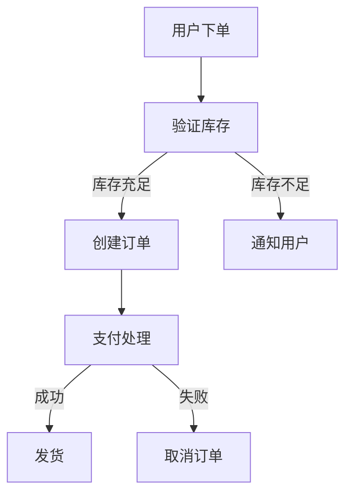

这个流程确保了订单的完整性和可靠性。
````

### 2. 展示系统架构

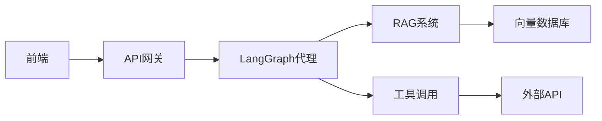

### 3. 说明交互时序

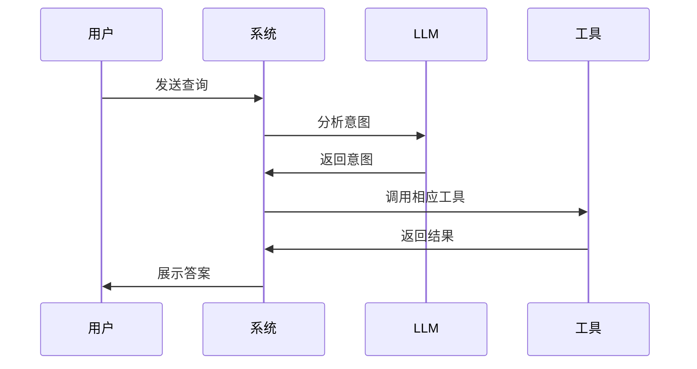

## 技术实现

### 组件架构

- **MermaidDiagram**: 独立的 Mermaid 渲染组件

  - 使用 `mermaid` 库进行图表渲染
  - 支持错误处理和调试
  - 自动生成唯一 ID 避免冲突

- **MarkdownText**: 扩展的 Markdown 渲染器
  - 自动检测 `mermaid` 代码块
  - 无缝集成 MermaidDiagram 组件
  - 保持与其他 Markdown 特性的兼容性

### 配置说明

Mermaid 初始化配置（在 `mermaid-diagram.tsx` 中）：

```typescript
mermaid.initialize({
  startOnLoad: false, // 手动控制渲染时机
  theme: "default", // 默认主题
  securityLevel: "loose", // 允许更灵活的渲染
  fontFamily: "inherit", // 继承页面字体
});
```

## 测试

在测试页面中查看完整示例：

```
http://localhost:3000/test-components
```

选择 **🔷 Mermaid 图表** 标签页，可以看到：

1. 流程图示例
2. 序列图示例
3. 甘特图示例
4. 饼图示例
5. 类图示例
6. Markdown 中的 Mermaid 集成测试

## 常见问题

### Q: Mermaid 图表不显示？

A: 检查以下几点：

1. 确保 Mermaid 代码语法正确
2. 检查浏览器控制台是否有错误信息
3. 确认 `mermaid` 依赖已正确安装

### Q: 如何自定义图表样式？

A: 可以在 `mermaid-diagram.tsx` 中修改 `mermaid.initialize()` 的配置，支持的主题包括：

- `default`
- `dark`
- `forest`
- `neutral`

### Q: 图表渲染错误怎么办？

A: MermaidDiagram 组件会自动捕获错误并显示友好的错误信息，包括：

- 错误消息
- 原始 Mermaid 代码（可展开查看）

## 参考资源

- [Mermaid 官方文档](https://mermaid.js.org/)
- [Mermaid Live Editor](https://mermaid.live/) - 在线测试 Mermaid 语法
- [Mermaid 语法速查表](https://mermaid.js.org/syntax/flowchart.html)

## 更新日志

### v1.1.1 (2025-10-15)

- ✅ **修复**: 修复 Markdown 中 Mermaid 图表背景显示问题
- ✅ **优化**: 移除渲染容器的样式冲突，确保透明背景在所有场景下生效

### v1.1.0 (2025-10-15)

- ✅ **新增**: 透明背景支持，图表自动适应页面颜色
- ✅ **新增**: 源代码查看按钮，可折叠展开查看 Mermaid 源代码
- ✅ **优化**: 简化测试页面布局，移除重复的代码展示

### v1.0.0 (2025-10-15)

- ✅ 添加 Mermaid 渲染支持
- ✅ 集成到 Markdown 渲染器
- ✅ 添加测试页面和示例
- ✅ 支持多种图表类型
- ✅ 错误处理和友好提示
